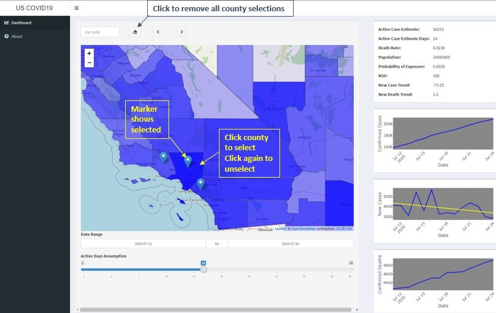

## Introduction

This was built to satisfy a personal curiosity. As the COVID 19
pandemic snowballed I found myself asking how likely it is that
I have been exposed to the virus if I go out in public.
This is my attempt to answer that question.

## Usage

Once you have zoomed into the part of the country you want to review.

As you select counties on the map you will note that the plots and
the summary statistics shown on the right will update to reflect
your selections.

## About the analysis

As you can see there are 3 plots and one summary table displayed
on the right side. These will update as you select and unselect
counties on the map, and when you change the "Active Days Assumption".
This happens because choosing counties limits the geographic region
over which the analysis is performed, and changing the active days
assumption alters the estimation of active cases for the defined
geographic region.

### Plots

Starting from the top:

- Shows how the number of confirmed cases for the defined
  geographic region changes over time

- Shows how the number of new cases for the defined
  geographic region changes over time
- Shows how the probability of being exposed to the virus
  changes as you encounter the number of people indicated
  on the X axis
  
### Summary table

The summary table shows the following:

- Active Case Estimate
    - This is calculated by adding all of the new cases for the
      defined geographic region for the preceding number of days
      indicated by the "Active Days Assumption"
- Active Case Estimate Days
    - This is simply the "Active Days Assumption" value
- Population
    - This is the population for the selected geographic region
- Probability of Exposure
    - This is the calculated estimate of the probability of
      being exposed to the virus given the selected geographic
      region and active days assumption. As is the case for any
      probability 0 means that there is no chance of this
      occurring and 1 means that it has definitely occurred
- N50
    - Given the "Probability of Exposure" this is the minimum
      number of people you would need to encounter in order
      for it to be more likely than not that you have been
      exposed, i.e. the probability becomes greater than 0.5
- New Case Trend
    - As you will note in the "New Cases" plot there is a
      yellow line, which is a line that best fits the data;
      this is the slope of that line. Therefore, a number
      greater than zero means that the number of new cases
      is increasing and a number less than zero means that
      the number of new cases is decreasing

## Calculating "Probability of Exposure"

To calculate the probability of exposure I make the assumption
that all of the individuals whom are actively infected with
COVID 19 are walking about in the geographic region selected
and are equally likely to be at any location in that geographic
region. Given that assumption the probability is simply the
number of active cases divided by the population for that
geographic region.

For calculating the number of active cases I sum the new
cases reported during the number of preceding days indicated
by the "Active Days Assumption" value. By default this is 14
days, which is reported to be the average number of days that
an infected individual can transmit the virus to others.

## Reference

COVID case and state/county population data for this analysis is provided by
[USAFacts](https://usafacts.org/visualizations/coronavirus-covid-19-spread-map/)

## About the author

This analysis was developed by Clifford Wollam, whom
is employed as a Senior Data Engineer at Bayer Crop Science
in St. Louis Missouri. The work was produced outside of work
hours using personal resources and was not created while
acting as an employee of or under the direction of Bayer.

If you have any questions or comments about this analysis
you may email <covid19@ca3tech.com>

## Disclaimer

This analysis is provided purely for informational purposes.
No decisions regarding whether it is safe to go out into
public should be made strictly based on the information
presented here. The author cannot be held liable if you
contract COVID 19.
